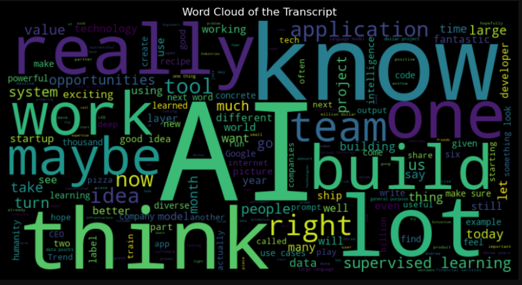
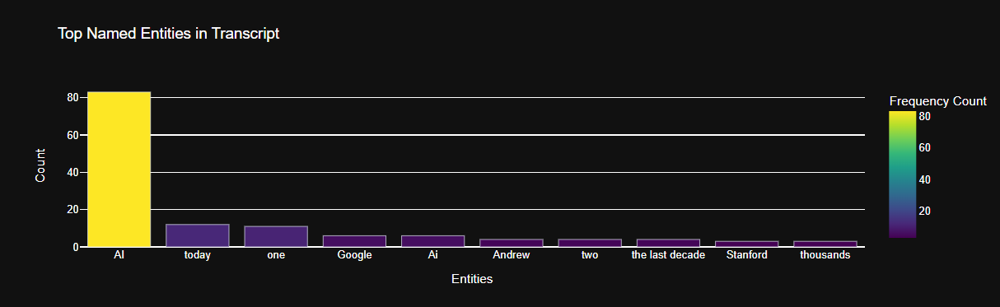
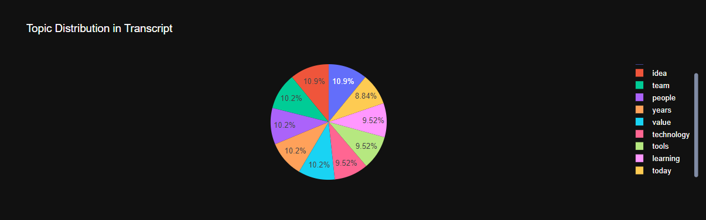
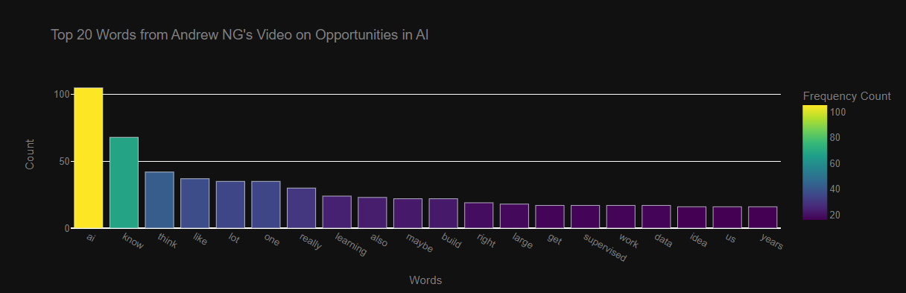
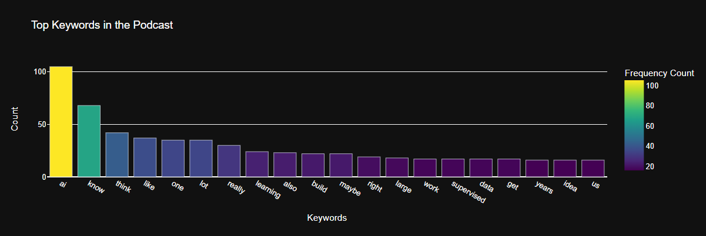

# 📊 DataViz-AndrewNG_Video_to_Vizs

Welcome to DataViz-AndrewNG_Video_to_Vizs! This project aims to uncover insights from Andrew NG's video on the opportunities in AI. We dig into the transcript to find out what words are used most often, what entities are mentioned, and what the overall sentiment is. 

---

## 🌟 Why This Matters

Understanding the crux of influencial videos like this can help us grasp where the field of AI is heading. This can be beneficial for students, professionals, and enthusiasts alike.

---

## 🎯 What We Do

- **🔍 Fetch Transcript**: Pulls the transcript of Andrew NG's video from YouTube.
- **📝 Text Processing**: Cleans the transcript and prepares it for analysis.
- **📊 Frequency Analysis**: Finds the most commonly used words and entities.
- **🌈 Sentiment Analysis**: Measures the mood throughout the video.
- **🖼️ Visualizations**: Creates graphs and word clouds to visually represent the findings.

---

## 🛠️ How It Works

### 1️⃣ Setup

To run the notebook, you'll need Python installed on your machine. You also need to install some Python packages:

```bash
pip install youtube_transcript_api nltk spacy plotly wordcloud
```

### 2️⃣ Get the Transcript

We use the `youtube_transcript_api` to pull the transcript from YouTube. You'll need to specify the video ID.

### 3️⃣ Text Processing

We clean up the transcript, remove common words and prepare it for analysis using libraries like `nltk` and `spacy`.

### 4️⃣ Run Analysis

The notebook will generate various plots and insights into the video content.

---

## 📈 Example Visualizations

### 🌟 Word Cloud of Transcript


### 🌟 Top Named Entities Frequency Bar Chart


### 🌟 Top Topics in Transcript


### 🌟 Top 20 Most Frequent Words


### 🌟 Top Keywords in Podcast


---
